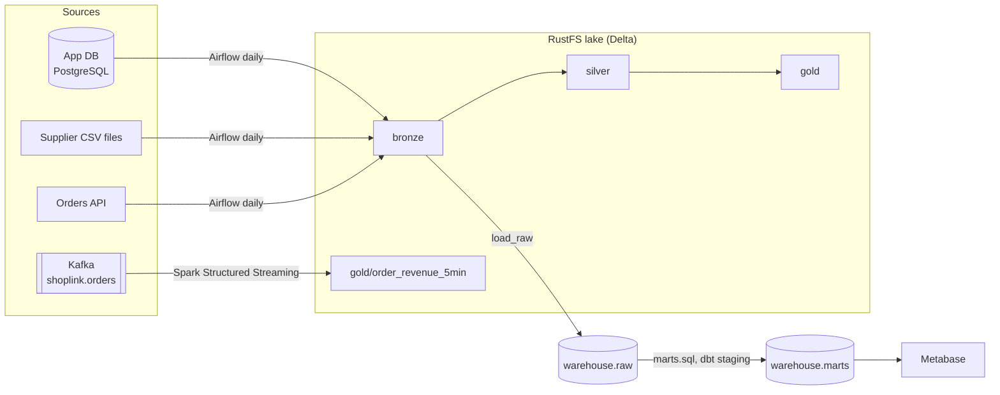

# Lesson: The capstone brief

minutes: 45

## What you are building

The capstone is not a new topic. It is every module of this track, assembled, finished and explained, in the `shoplink-data-platform` repository you started in Module 2. When you are done, someone who has never met you should be able to clone it, read the README, start it with Docker Compose, and watch data flow from three kinds of source, through the lake and the warehouse, to a dashboard.

The shape of the platform:

```text
 SOURCES                   INGESTION               STORAGE                     SERVING
 App database (Postgres) ─┐
 Supplier CSV files ──────┼─ Python + Airflow ──► bronze ─► silver ─► gold ─┐
 Orders API ──────────────┘   (daily, batch)      (RustFS, Delta, Spark)    ├─► warehouse.marts ─► Metabase
                                                                            │   (dbt or SQL)        or Power BI
 Order events (Kafka) ─────── Spark Structured Streaming ─► gold/order_revenue_5min
                              (continuous)
            Data quality checks and monitoring run at every step
            Everything in Docker Compose and Git; optionally mirrored to AWS with OpenTofu
```

The marts are built from `warehouse.raw` by SQL and dbt; the Spark gold tables are a second serving path over the same bronze data.

## Two ways to do it

**Option A: finish ShopLink.** Most of the platform already exists in your repository from Modules 2 to 9. The capstone is where you make it complete, consistent and presentable: one DAG that runs the whole batch path, the stream alongside it, quality checks and monitoring that cover every step, a dashboard, and documentation. This is the safer choice, and there is no shame in it: a finished, polished ShopLink platform is a strong portfolio piece.

**Option B: your own dataset.** Swap ShopLink for data from a field you care about: banking, logistics, health, agriculture, sport. It shows you can design a platform without a guide, and gives you something distinctive to talk about in interviews. You still need three source types, so plan how you will get each one: a real public API (for example exchange rates, weather or transport data), files (a public dataset split into daily drops), and a database (load part of the dataset into PostgreSQL to play the app database). For the stream, write a replay producer like `streaming/produce_orders.py` that publishes your data as events. Pick data with at least three related tables, a few thousand rows, a timestamp and some real mess to clean.

The requirements are the same for both.

## Minimum requirements

| Area | You must have |
|---|---|
| Ingestion | At least three source types: a relational database, files (CSV or JSON), and a REST API, each landed raw in bronze with load metadata |
| Storage and modelling | Bronze, silver and gold layers in object storage (Delta tables), and warehouse marts in PostgreSQL: at least one fact and two dimensions, with the grain of each written down |
| Batch orchestration | An Airflow DAG (`shoplink_daily_ingest` or your equivalent) that runs extraction, loading, Spark and dbt (or SQL) transforms and checks, in order, idempotently, with retries and alerts |
| Streaming | A Kafka topic, a producer, and a Spark Structured Streaming job with a watermark and a checkpoint, writing a gold table, with evidence that a restart does not double count |
| Transformation | dbt models or SQL transforms from staging to marts, in version control |
| Data quality | Checks for nulls, duplicates, invalid values, referential integrity, schema changes and freshness (next section) |
| Monitoring | Pipeline status, task failures, processing time, record counts and error logs, recorded and visible (next section) |
| Infrastructure | The whole platform in one `compose.yaml`, secrets in `.env` (with `.env.example` committed), no credentials in Git |
| Version control | Work merged into `main` through pull requests with clear descriptions |
| Serving | A dashboard on the marts (Metabase, or Power BI) |
| Optional | The lake on AWS with OpenTofu, as in Module 9, destroyed after your screenshots |

## Data quality: the six checks

You have built most of these already. The capstone asks for all six, each in the place where it catches the problem earliest:

| Check | ShopLink example | Where it usually lives |
|---|---|---|
| Nulls | 12 customers with no city; `order_id` never null | dbt `not_null` tests; the pydantic models at ingestion |
| Duplicates | 6 exact duplicate order lines; one row per order in silver | dbt `unique` tests; a duplicate-key count in the Spark silver job; `dropDuplicatesWithinWatermark` in the stream |
| Invalid values | Status spellings; quantity 0 and -2 | `accepted_values` after cleaning; quarantine at ingestion with a threshold that stops the run |
| Referential integrity | 3 orphan orders with customer IDs 9001 to 9003 | dbt `relationships` tests, with the orphans sent to an "unknown" customer rather than dropped |
| Schema changes | The supplier adds a column to `products.csv`, or renames one | Validation at ingestion comparing columns with the expected list; Delta's schema enforcement in silver |
| Freshness | Yesterday's orders have not arrived by 07:00 | dbt source freshness; a freshness query; Airflow's deadline alert from Module 7 |

A check that nobody sees is not a check. For each one, decide what happens when it fails: stop the pipeline, quarantine and continue, or warn. Write that down in `DATA_QUALITY.md`.

## Monitoring: know before the business does

Airflow already records pipeline status, failures, durations and logs for every task. For the capstone, also keep your own record in the warehouse, so counts and timings can be queried and charted next to the business data. A small table is enough:

```sql
create schema if not exists ops;

create table if not exists ops.pipeline_runs (
    run_id        bigint generated always as identity primary key,
    pipeline      text        not null,
    task          text        not null,
    load_date     date,
    status        text        not null check (status in ('success', 'failed')),
    rows_in       bigint,
    rows_out      bigint,
    started_at    timestamptz not null,
    finished_at   timestamptz not null,
    error_message text
);
```

`ops.pipeline_runs` replaces Module 6's `raw.pipeline_runs`. That table was written by `run_batch.py`, but your Airflow tasks call the pipeline code directly, so nothing writes it any more, and run metadata belongs in an `ops` schema rather than next to the source data in `raw`. Note that the status values have changed too: Module 6 recorded `succeeded`, this table uses `success`. Once the new table is filling, drop the old one with `drop table raw.pipeline_runs;`.

Each task (or an Airflow success and failure callback) inserts one row. Then the questions a person on call asks become queries:

```sql
-- the latest run of every task: status, rows, seconds taken, and the error if it failed
select distinct on (task)
       task, load_date, status, rows_out,
       round(extract(epoch from finished_at - started_at)) as seconds,
       error_message
from ops.pipeline_runs
where pipeline = 'shoplink_daily_ingest'
order by task, finished_at desc;
```

For the stream, the equivalents are Kafka **consumer lag** (from `kafka-consumer-groups.sh --describe`, or Spark's progress reports) and the time since the gold table's last commit. Five things to capture, and where each comes from:

| Signal | Batch | Streaming |
|---|---|---|
| Pipeline status | Airflow DAG run state; `ops.pipeline_runs.status` | Is the query running? Spark UI, Structured Streaming tab |
| Failures | `on_failure_callback` alerts; failed rows in `ops.pipeline_runs` | The job's exit and its driver log |
| Processing time | Task duration in Airflow; `finished_at - started_at` | Batch duration in the Spark progress report |
| Record counts | `rows_in` and `rows_out`, compared with recent days | Input rows per batch; rows in the gold table |
| Error logs | Airflow task logs; quarantine files | The `spark-submit` output; events that failed to parse |

## Resources

- deeper: [Fundamentals of Data Engineering](https://www.oreilly.com/library/view/fundamentals-of-data/9781098108298/) · Joe Reis and Matt Housley, O'Reilly (paid) · The data engineering lifecycle and its undercurrents (security, DataOps, orchestration), which is the checklist behind this capstone.
- docs: [Airflow: logging and monitoring](https://airflow.apache.org/docs/apache-airflow/stable/administration-and-deployment/logging-monitoring/index.html) · Apache Airflow · Task logs, metrics and callbacks, for the monitoring requirement.
- docs: [Add data tests to your DAG](https://docs.getdbt.com/docs/build/data-tests) · dbt Labs · The generic tests behind four of the six quality checks.
- watch: [Data Engineering Course for Beginners](https://www.youtube.com/watch?v=PHsC_t0j1dU) · freeCodeCamp.org · 11.9M subscribers · 1.1M views · 17K likes · published 2024-01-16 · checked 2026-09-28 · 184 min

## Practice

Write a one-page capstone proposal and commit it as `CAPSTONE_PROPOSAL.md`:

1. Option A or B. For B: the dataset, its links, its tables, and how you will produce each of the three source types and the event stream.
2. Three to five business questions the platform answers.
3. The marts you will serve, each with its grain in one sentence.
4. For each of the six quality checks: one concrete check, where it lives, and what happens when it fails.
5. The monitoring you will add beyond what Airflow gives you.
6. One risk to finishing and how you will manage it.

## Example answer

A strong option A proposal, in outline:

**Project:** ShopLink data platform (option A).

**Questions:** daily and monthly net revenue by warehouse; top categories and brands; top customers and reorder frequency; cancellation rate by channel; today's revenue so far, from the stream.

**Marts:** `fct_order_lines` (one row per order line), `dim_customer` (one row per customer version, SCD Type 2), `dim_product` (one row per product), `dim_warehouse` (one row per warehouse), `dim_date` (one row per day).

**Quality checks:**

| Check | Concrete check | Where | On failure |
|---|---|---|---|
| Nulls | `order_id`, `customer_key`, `net_amount` not null in the fact | dbt | Stop: the build fails and the dashboard keeps yesterday's data |
| Duplicates | `order_line_id` unique in silver and in the fact | Spark job and dbt | Stop |
| Invalid values | `quantity > 0`; status in the five known values | Ingestion quarantine; dbt `accepted_values` | Quarantine; stop if more than 2% of a load |
| Referential integrity | Every fact row has a customer, product and warehouse | dbt `relationships` | Warn: orphans go to the unknown member, and the count is reported |
| Schema changes | `products.csv` columns match the expected list | File ingestion task | Stop before loading, with the old and new column lists in the alert |
| Freshness | Latest order in the warehouse is no older than one day | dbt source freshness; deadline alert at 07:00 | Warn at 1 day, error at 2 |

**Monitoring:** `ops.pipeline_runs` written by every task, a Metabase question on it ("latest run per task"), and consumer lag recorded after each streaming session.

**Risk:** memory. The full stack does not fit in 16 GB at once, so I will run batch sessions and streaming sessions separately (next lesson), and record evidence from each.

For option B the structure is the same, for example: "Lagos bus journeys: a PostgreSQL copy of the operator's trips table, daily CSV fare files, a public weather API, and a replay of tap-in events as the stream."

# Lesson: Milestones and planning

minutes: 40

## Plan backwards from a finished platform

The most common way to fail a capstone is not a hard bug. It is running out of time with everything 80% done. Plan in milestones, each ending with something working and merged to `main`.

| Milestone | Goal | Done when |
|---|---|---|
| 1. Proposal and repository tidy-up | Scope agreed; repository clean | `CAPSTONE_PROPOSAL.md` merged; `.env.example` complete; `docker compose config` runs clean |
| 2. Ingestion | All three sources land in bronze | One Airflow run lands the app database, the supplier file and the API; row counts in `ops.pipeline_runs` |
| 3. Lake and warehouse | Silver, gold and marts build from bronze | Spark jobs, the `build_marts` task and dbt run from the DAG; marts row counts match your checks |
| 4. Streaming | Events to gold, reliably | Producer, streaming job, restart evidence and reconciliation, as in Module 9 |
| 5. Quality and monitoring | Problems are caught and visible | All six checks in place; `DATA_QUALITY.md`; the monitoring query and alerts working |
| 6. Serving | Someone can see the answers | Metabase (or Power BI) dashboard on the marts |
| 7. Presentation | Someone else understands it | README, architecture diagram, walkthrough video |

Assume three to four weeks part time. Adjust the pace, not the order: presentation last, but never skipped.

## Scoping for a laptop

The full platform needs more memory than most laptops have free at once. Rough figures:

| Services | Memory, roughly |
|---|---|
| `postgres`, `rustfs`, `mock-api` | 1 GB together |
| Airflow (`airflow-apiserver`, `airflow-scheduler`, `airflow-dag-processor`, `airflow-triggerer`) | 2 to 3 GB |
| Spark (`spark-master`, `spark-worker`, `jupyter`) | 4 GB |
| `kafka` | 1 GB |
| `metabase` | 1 to 1.5 GB |

Do not run everything together. Work in **sessions**, each with its own set of services, and stop the rest (`docker compose stop <service>`):

| Session | Start | Stop |
|---|---|---|
| Batch: build and test the daily pipeline | postgres, rustfs, mock-api, Airflow, spark-master, spark-worker | kafka, jupyter, metabase |
| Streaming: run and prove the stream | kafka, rustfs, spark-master, spark-worker, jupyter | Airflow, metabase |
| Serving: dashboards and screenshots | postgres, metabase | everything else |

If you use WSL on Windows, Docker's memory comes from WSL's limit, which is set in `%UserProfile%\.wslconfig` (a `[wsl2]` section with `memory=10GB`, for example); restart WSL with `wsl --shutdown` after changing it. On 8 GB machines, run one session at a time and lower the worker's memory (`SPARK_WORKER_MEMORY`). The capstone is graded on evidence, not on everything running at once: screenshots and logs from each session are enough.

**Cut width, not depth.** If you fall behind, drop a feature, not quality:

| If you are behind, cut this | Never cut this |
|---|---|
| A second streaming aggregate | Idempotent loads and the restart evidence |
| AWS deployment | The six quality checks |
| Extra dashboard pages | The README and architecture diagram |
| A fourth source | Secrets out of Git |

## Your capstone checklist

Copy this into a GitHub issue in your repository and tick items off as you merge them:

```text
Ingestion
[ ] App database extract to bronze (incremental where it can be)
[ ] Supplier file ingestion with schema check
[ ] Orders API ingestion with pagination, retries and a watermark
Lake and warehouse
[ ] Silver and gold Delta tables built by Spark jobs
[ ] Marts with at least one fact and two dimensions, grain documented
Orchestration
[ ] One DAG runs the batch path in order, idempotently, with retries and alerts
[ ] A backfill of three days runs without duplicates
Streaming
[ ] Producer, topic and streaming job with watermark and checkpoint
[ ] Restart evidence and reconciliation with the batch layer
Quality and monitoring
[ ] Nulls, duplicates, invalid values, referential integrity, schema changes, freshness
[ ] ops.pipeline_runs (or equivalent) written by every task
[ ] DATA_QUALITY.md
Serving and presentation
[ ] Dashboard on the marts
[ ] README, architecture diagram, walkthrough video
Hygiene
[ ] All work merged through pull requests; no secrets, data or build outputs committed
```

## Asking for peer review

A second pair of eyes catches what you cannot see. Share a milestone for peer review on 1501 Learn, or ask someone in a data community to review one pull request, not your whole project: a focused request gets a useful answer.

A good request contains:

1. **What the change does**, in two sentences.
2. **How to check it**: the commands to run, or the query to look at.
3. **What you are unsure about**: "I am not sure the stream's watermark of 10 minutes is right for WhatsApp orders" gets a better answer than "any feedback?".
4. **A deadline**, politely.

When comments come back, reply to each one: change the code, or explain why not. Then review someone else's; reading other people's pipelines is one of the fastest ways to improve your own.

## Resources

- docs: [Requesting a pull request review](https://docs.github.com/en/pull-requests/collaborating-with-pull-requests/proposing-changes-to-your-work-with-pull-requests/requesting-a-pull-request-review) · GitHub · How to ask for a review and what reviewers see.
- docs: [Docker Compose: control startup and shutdown](https://docs.docker.com/compose/how-tos/startup-order/) · Docker · Health checks and `depends_on` conditions, useful when you start services in sessions.
- docs: [Advanced settings configuration in WSL](https://learn.microsoft.com/en-us/windows/wsl/wsl-config) · Microsoft Learn · The `.wslconfig` memory setting for Docker Desktop on WSL 2.

## Practice

1. Create a GitHub issue with the capstone checklist.
2. Give each milestone a target date, based on the hours a week you can give. Put the dates in the issue.
3. Measure your own machine: in a batch session, run `docker stats --no-stream` and record the memory used by each container. Write your session plan from the numbers.
4. Name the milestone most likely to overrun and what you would cut if it does.
5. Open your milestone 1 pull request and ask for one review using the four-part request.

## Example answer

A realistic plan for someone with about ten hours a week:

| Milestone | Target | Notes |
|---|---|---|
| 1. Proposal and tidy-up | Day 3 | Option A; fix `.env.example`, remove a stray `logs/` folder from Git |
| 2. Ingestion | Day 8 | Add the schema check to the supplier file task |
| 3. Lake and warehouse | Day 12 | Spark, `build_marts` and dbt already run from the DAG; add row-count checks |
| 4. Streaming | Day 15 | Module 9 work; rerun the restart evidence on the final code |
| 5. Quality and monitoring | Day 20 | `ops.pipeline_runs` and the freshness check are new |
| 6. Serving | Day 23 | Metabase dashboard |
| 7. Presentation | Day 27 | Two days of buffer after it |

A `docker stats` reading in a batch session might look like this: postgres 150 MB, rustfs 120 MB, mock-api 60 MB, the four Airflow services 2.1 GB together, spark-master 400 MB, spark-worker 1.2 GB (more while a job runs). About 4 GB, which leaves room for a browser on a 16 GB machine but not for Kafka and Metabase as well.

Most likely to overrun: milestone 5, because monitoring touches every task. If it does, write `ops.pipeline_runs` rows from the two most important tasks (the orders API load and dbt) and document the rest as next steps.

A good review request: "This PR adds a schema check to the supplier file task: it compares the CSV header with the expected columns and fails with both lists in the alert. To check it, add a column to a copy of `products.csv` and trigger the DAG. I am unsure whether a new column should fail the run or only warn. Could you take a look this week?"

# Lesson: Learning from real-world projects

minutes: 50

## Read before you write

Engineers learn by reading other people's code. The projects below were built by practitioners and teachers to show end-to-end data engineering. None is perfect, and that is useful: you learn as much from what they leave out as from what they do well. Do not copy them. Read them with a checklist, take notes, and borrow ideas.

## What to look for

| Question | Where to look |
|---|---|
| What problem does it solve, for whom? | The top of the README |
| What are the sources, and how does data get in? | The architecture diagram; an `ingestion`, `dags` or `producers` folder |
| Batch, streaming, or both? How do they meet? | DAG files; Kafka and Spark streaming code |
| How is storage layered? | Bucket or folder names (raw, bronze, staging, marts) |
| What happens on a rerun or a failure? | Upserts or overwrites; retries; checkpoints |
| What is checked, and what is monitored? | Tests, validation code, alerting, dashboards |
| Could you run it yourself? | Setup steps, `compose.yaml`, `.env.example`, how secrets are handled |
| What would you do differently? | Your judgement: the most valuable note |

## The projects

**1. Data Engineering Zoomcamp (DataTalksClub).** A free, community-run course repository with modules on Docker and Terraform, workflow orchestration, data warehousing, analytics engineering, batch processing with Spark and streaming with Kafka, plus a list of past learners' final projects. Browse the projects list for ideas and for the range of quality; the best ones are clear about their problem in the first paragraph.

**2. Streamify.** Simulated music-streaming events sent through Kafka, processed with Spark Streaming into a data lake on Google Cloud Storage, then modelled with dbt in BigQuery on an hourly Airflow schedule, with Terraform for the infrastructure. It is the closest in shape to your platform. Notice that its README warns about cloud charges up front, and that it has not been updated since 2022: check which versions it pins.

**3. Realtime data streaming (CodeWithYu).** An API feeding Airflow, then Kafka, then Spark into Cassandra, all in Docker Compose, with a matching video walkthrough. Good for seeing how the pieces are wired in one compose file. Read it critically: it uses ZooKeeper, which modern Kafka no longer needs, and has little testing.

**4. Beginner data engineering project, batch edition (Start Data Engineering).** Airflow, PostgreSQL, DuckDB and Spark, with a Makefile, CI checks and tests, and an accompanying blog post that explains every design choice. Look at how `make up` and `make ci` make it runnable in two commands.

**5. News data pipeline (damklis).** RSS feeds scraped on an Airflow schedule into Kafka, then Kafka Connect sinks to MongoDB, Elasticsearch and MinIO, with Debezium change data capture between them and a small API on top. It shows patterns you have only read about (Kafka Connect, CDC) and has proper tests and an architecture diagram.

**6. The Data Engineer Handbook (DataExpert.io).** Not one project but a large, maintained collection of links: books, communities, newsletters and many more project ideas. Use it after the capstone, to choose what to learn next.

The owner of this course also recommends two longer video builds from CodeWithYu, in the resources: an Apache Airflow and Spark cluster project, and a high-throughput Kafka and Spark build processing 1.2 billion records an hour, with monitoring. And the Coursera specialisation below covers almost exactly this track's open-source stack, if you want a second structured pass.

## Patterns you will notice

- **The best READMEs start with the problem**, not the list of tools.
- **An architecture diagram does most of the explaining.** Every strong project has one near the top.
- **Few projects prove idempotency or restarts.** Your Module 6 and Module 9 evidence is a real differentiator.
- **Testing and monitoring are usually the weakest parts.** Six named quality checks and a monitoring table will make your platform stand out.
- **Many projects are hard to run**: missing versions, secrets in files, no `.env.example`. A platform that starts with one command is rare and memorable.

## Resources

- project: [Data Engineering Zoomcamp](https://github.com/DataTalksClub/data-engineering-zoomcamp) · GitHub, DataTalksClub · A free course repository covering Docker, Terraform, orchestration, warehousing, Spark and Kafka, with a list of learners' final projects.
- project: [Streamify](https://github.com/ankurchavda/streamify) · GitHub, ankurchavda · Kafka and Spark Streaming into a lake, dbt, Airflow and Terraform on Google Cloud.
- project: [Realtime data streaming: end-to-end project](https://github.com/airscholar/e2e-data-engineering) · GitHub, airscholar (CodeWithYu) · API, Airflow, Kafka, Spark and Cassandra in Docker Compose, with a video walkthrough.
- project: [Beginner data engineering project: batch edition](https://github.com/josephmachado/beginner_de_project) · GitHub, josephmachado (Start Data Engineering) · Airflow, PostgreSQL, DuckDB and Spark, with a Makefile, tests and CI.
- project: [News data pipeline](https://github.com/damklis/DataEngineeringProject) · GitHub, damklis · Airflow, Kafka, Kafka Connect, Debezium, MongoDB, Elasticsearch and MinIO, with tests.
- project: [The Data Engineer Handbook](https://github.com/DataExpert-io/data-engineer-handbook) · GitHub, DataExpert-io · A maintained collection of books, communities and project ideas.
- watch: [Realtime Data Streaming | End To End Data Engineering Project](https://www.youtube.com/watch?v=GqAcTrqKcrY) · CodeWithYu · 36.5K subscribers · 348K views · 8.4K likes · published 2023-09-06 · checked 2026-09-28 · 88 min
- watch: [Apache Airflow with Spark, Pyspark, Java, Scala for Data Engineers || Full Course](https://www.youtube.com/watch?v=o_pne3aLW2w) · CodeWithYu · 36.5K subscribers · 29.5K views · 469 likes · published 2023-11-04 · checked 2026-09-28 · 69 min
- watch: [1.2 Billion Records Per Hour High Performance Kafka and Spark - End to End Data Engineering Project](https://www.youtube.com/watch?v=d6AFh31fO7Y) · CodeWithYu · 36.5K subscribers · 23.4K views · 704 likes · published 2024-12-03 · checked 2026-09-28 · 138 min
- deeper: [Data Engineering with Open Source Tools](https://www.coursera.org/specializations/open-source-data-engineering) · Coursera · A specialisation on SQL, Python, PostgreSQL, PySpark, dbt, Airflow, Iceberg, MinIO, Kafka and Structured Streaming, with hands-on projects.

## Practice

1. Review at least four of the six projects with the "what to look for" table, about fifteen minutes each. Keep your notes in `notes/project-reviews.md` in your repository.
2. For each, write one thing you will borrow and one thing you would do differently.
3. Watch the first 30 minutes of one of the CodeWithYu videos and write down every design decision the presenter explains, and one they make without explaining.
4. Pick the best README you saw and list its sections in order. You will use the list in the next lesson.

## Example answer

A strong review, for Streamify:

| Question | Notes |
|---|---|
| Problem | Live analytics on a (simulated) music streaming service: which songs, artists and regions are active |
| Sources and ingestion | Eventsim generates page-view, listen and auth events into Kafka |
| Batch and streaming | Spark Streaming writes the events to Google Cloud Storage continuously; Airflow runs hourly batch jobs to load BigQuery and run dbt |
| Storage layers | Raw event files in the lake, then staging and fact and dimension models in BigQuery |
| Reruns and failures | The hourly batch works by time partition, so an hour can be rerun; no explicit restart or duplicate evidence for the stream |
| Checks and monitoring | Few data tests; the dashboard doubles as monitoring |
| Could I run it? | Yes, with a GCP account: Terraform setup is documented, with a clear cost warning |
| **Borrow** | The architecture image at the top and the cost warning before any setup step |
| **Do differently** | Prove the stream survives a restart without duplicates (checkpoint plus an idempotent sink) and add freshness and row-count checks between the lake and BigQuery |

For step 4, a good answer picks a README that goes: problem, architecture diagram, tools, dataset, how to run it, results (a dashboard screenshot), and what the author would improve. Other choices are fine; what matters is that you can say why the one you chose works.

# Lesson: Serving and presenting

minutes: 60

## The last mile: someone has to see the numbers

A platform nobody looks at has no value. The last layer is **serving**: putting the marts in front of people. You use **Metabase**, an open-source BI tool that runs in Docker next to everything else. If you are on Windows and want the tool many Nigerian employers use, **Power BI Desktop** connects to the same marts, as a second option below.

## Add Metabase to compose.yaml

For this session you only need `postgres` and `metabase`; stop the rest. Metabase keeps its own settings (users, questions, dashboards) in an application database. It can use a built-in file database, but the Metabase documentation recommends PostgreSQL, and you already run one. Your Module 2 init script created a `metabase` database for it. Check it is there:

```bash
docker compose exec postgres psql -U shoplink -d postgres -c "\l metabase"
```

If it is missing, your postgres volume is older than that line of the init script (the script only runs on an empty volume). Create it by hand: `docker compose exec postgres createdb -U shoplink metabase`.

Then add the service:

```yaml
  metabase:
    image: metabase/metabase:v0.63.18.4
    ports:
      - "127.0.0.1:3000:3000"
    environment:
      MB_DB_TYPE: postgres
      MB_DB_DBNAME: metabase
      MB_DB_PORT: 5432
      MB_DB_USER: shoplink
      MB_DB_PASS: ${POSTGRES_PASSWORD}
      MB_DB_HOST: postgres
    depends_on: [postgres]
    healthcheck:
      test: curl --fail -I http://localhost:3000/api/health || exit 1
      interval: 15s
      timeout: 5s
      retries: 5
```

Start it with `docker compose up -d metabase` and watch `docker compose logs -f metabase`: the first start takes a minute or two while Metabase sets up its tables. Once `docker compose ps` shows it healthy, open http://localhost:3000. The image is pinned to an exact version rather than `latest`, so a future image cannot change your setup without you noticing; upgrade on purpose, by changing the tag.

## A read-only login for BI

Metabase should not use the `shoplink` superuser: a BI tool only needs to **read** the marts. Create a role that can do exactly that. Connect with `docker compose exec postgres psql -U shoplink -d warehouse` and run:

```sql
create role metabase_reader login password 'choose-a-long-password';
grant connect on database warehouse to metabase_reader;
grant usage on schema marts to metabase_reader;
grant select on all tables in schema marts to metabase_reader;
alter default privileges for role shoplink in schema marts
    grant select on tables to metabase_reader;
```

The last statement matters because `sql/transforms/marts.sql` (and dbt, if you move the marts into dbt) drops and recreates the tables on every run: without it, the grant would vanish at the next run. `alter default privileges` makes every future table that `shoplink` creates in `marts` readable by `metabase_reader` too. Put the password in `.env` as `METABASE_READER_PASSWORD` and its name (not its value) in `.env.example`. The reader cannot see `raw` or `staging`, where personal data such as customer emails lives, and cannot write anything.

## Connect Metabase to the warehouse

In Metabase's first-run setup (or later under Admin, Databases, Add database), choose **PostgreSQL** and fill in:

| Field | Value |
|---|---|
| Display name | ShopLink warehouse |
| Host | `postgres` (the service name: Metabase runs in a container) |
| Port | 5432 |
| Database name | `warehouse` |
| Username | `metabase_reader` |
| Password | your `METABASE_READER_PASSWORD` |
| Schemas | Only these: `marts` |

Metabase scans the tables and lists them under Browse data.

## A small ShopLink dashboard

Build four questions with **New, SQL query**, save each, and add them to a new dashboard called "ShopLink sales". The SQL assumes the star schema from Module 5: `fct_order_lines` with `date_key`, `product_key`, `warehouse_key`, `order_id`, `order_status` and `net_amount`, and `dim_date` (`date_key`, `full_date`), `dim_product` and `dim_warehouse`. The fact's `net_revenue` is already 0 for cancelled and returned lines, so `sum(f.net_revenue)` without the status filter gives the same result. If your names differ, change them.

**Net revenue by month** (visualise as a line):

```sql
select date_trunc('month', d.full_date)::date as month,
       sum(f.net_amount) as net_revenue
from marts.fct_order_lines f
join marts.dim_date d on d.date_key = f.date_key
where f.order_status not in ('cancelled', 'returned')
group by 1
order by 1;
```

**Revenue by category** (bar):

```sql
select p.category, sum(f.net_amount) as net_revenue
from marts.fct_order_lines f
join marts.dim_product p on p.product_key = f.product_key
where f.order_status not in ('cancelled', 'returned')
group by 1
order by 2 desc;
```

**Revenue by warehouse** (bar):

```sql
select w.warehouse_name, sum(f.net_amount) as net_revenue
from marts.fct_order_lines f
join marts.dim_warehouse w on w.warehouse_key = f.warehouse_key
where f.order_status not in ('cancelled', 'returned')
group by 1
order by 2 desc;
```

**Cancellation rate by month** (line), counting orders, not lines:

```sql
select date_trunc('month', d.full_date)::date as month,
       round(100.0 * count(distinct f.order_id) filter (where f.order_status = 'cancelled')
             / count(distinct f.order_id), 1) as cancelled_pct
from marts.fct_order_lines f
join marts.dim_date d on d.date_key = f.date_key
group by 1
order by 1;
```

Check the first chart against your own numbers before you trust it: revenue should run at roughly ₦9 billion a month in 2024 rising to about ₦17 billion a month in 2026. A dashboard that disagrees with the warehouse is worse than no dashboard.

Two good additions, if you have time: a question on `ops.pipeline_runs` (grant `metabase_reader` read access to the `ops` schema the same way), so the dashboard shows whether last night's pipeline succeeded; and a text card that states the revenue definition in one sentence.

## Power BI Desktop, the Windows alternative

Power BI Desktop is free and Windows only. It connects to the same PostgreSQL, published on your Windows `localhost` by Docker Desktop even though the containers run in WSL:

1. Get data, **PostgreSQL database**. Server `localhost:5432`, database `warehouse`, data connectivity mode **Import**. The connector's Npgsql provider has been built into Power BI Desktop since December 2019, so there is nothing else to install.
2. Choose **Database** credentials: `metabase_reader` and its password (the same read-only login works for any BI tool; you could name a second role `bi_reader` instead).
3. Power BI warns that the connection is not encrypted, because your local PostgreSQL has no TLS. Select **OK** to continue unencrypted: acceptable on your own machine, never across a network.
4. In the Navigator, select the `marts` tables and load them. In **Model view**, check the relationships from `fct_order_lines` to each dimension on the key columns, one to many.
5. Add a measure, `Net revenue = CALCULATE(SUM(fct_order_lines[net_amount]), NOT fct_order_lines[order_status] IN {"cancelled", "returned"})`, and build the same four visuals.

Import copies the data into the report file, so refresh it after the pipeline runs. Either tool is fine for the capstone; do one well rather than both halfway.

## The README

A hiring manager may spend five minutes on your repository. The README has to carry them. Use this structure, and keep each part short:

1. **Title and one sentence.** "A data platform for ShopLink, a Lagos electronics distributor: three sources to a lakehouse and warehouse, batch with Airflow and Spark, streaming with Kafka, quality-checked and served in Metabase."
2. **The problem.** Three sentences and the questions it answers.
3. **Architecture.** A diagram, then one line per component.
4. **Data model.** The marts and the grain of each.
5. **Data quality and monitoring.** The six checks, what happens when each fails, and how you know the pipeline ran. Link `DATA_QUALITY.md`.
6. **Reliability.** Idempotent loads, backfills, and the stream's restart evidence, with numbers.
7. **How to run it.** Exact commands, the sessions, and the environment variables needed (never their values).
8. **Results.** A dashboard screenshot and a link to the walkthrough video.
9. **What I would do next.** Two or three honest improvements.

## An architecture diagram

GitHub draws diagrams written in **Mermaid** directly in a README, so your diagram lives in Git and changes with the code:

````markdown

````

Keep it to what exists. A diagram that shows components you did not build is the fastest way to lose a reviewer's trust.

## A five-minute walkthrough

Record a short screen video (a free screen recorder or a video call recording is fine) and link it from the README:

| Time | Show |
|---|---|
| 0:00 to 0:40 | The problem and the questions |
| 0:40 to 1:40 | The architecture diagram, one sentence per component |
| 1:40 to 2:40 | The Airflow DAG running, and a task log |
| 2:40 to 3:40 | The stream: events arriving, the restart, the duplicate check returning 0 |
| 3:40 to 4:20 | A data quality check failing on purpose, and what happens |
| 4:20 to 5:00 | The dashboard, and what you would do next |

Speak to a manager, not an examiner. "If the pipeline crashes halfway, rerunning it gives the same numbers, and here is the proof" is worth more than reading out code.

## What hiring managers look for

People hiring data engineers read portfolios for evidence of judgement:

- **Reliability thinking.** Idempotent loads, retries, backfills, restart evidence. "What happens if this runs twice?" answered before anyone asks.
- **Data quality.** Checks beyond "not null", noticed problems, and a decision about what each failure does.
- **Operability.** Could someone else run it, and would they know when it broke? Monitoring, alerts, a runbook entry.
- **Sensible scope.** The right tool for the size (Spark where it earns its place, DuckDB or PostgreSQL where it does not), and honesty about trade-offs.
- **Engineering habits.** Focused pull requests, readable commits, no secrets, data or build outputs in Git, and a platform that starts with one command.
- **Communication.** A README and a diagram that explain the platform without you in the room.

The most common reasons a portfolio project falls flat: a README that lists tools but not the problem, no evidence that it actually ran, committed passwords or keys, and a diagram of an architecture that does not exist. Check yours for all four.

## Resources

- docs: [Running Metabase on Docker](https://www.metabase.com/docs/latest/installation-and-operation/running-metabase-on-docker) · Metabase · The image, the application database settings and the health check used above.
- docs: [PostgreSQL connection in Metabase](https://www.metabase.com/docs/latest/databases/connections/postgresql) · Metabase · Every connection field, including the schema filter.
- docs: [Power Query PostgreSQL connector](https://learn.microsoft.com/en-us/power-query/connectors/postgresql) · Microsoft Learn · Connecting Power BI Desktop to PostgreSQL, Import or DirectQuery, and the unencrypted connection prompt.
- docs: [Creating diagrams in GitHub](https://docs.github.com/en/get-started/writing-on-github/working-with-advanced-formatting/creating-diagrams) · GitHub · Mermaid diagrams in READMEs and issues.
- docs: [ALTER DEFAULT PRIVILEGES](https://www.postgresql.org/docs/current/sql-alterdefaultprivileges.html) · PostgreSQL documentation · Why the read-only role keeps working after dbt rebuilds the marts.
- watch: [How to create a dashboard | Getting started with Metabase](https://www.youtube.com/watch?v=W-i9E5_Wjmw) · Metabase · 10.3K subscribers · 46.9K views · 272 likes · published 2024-08-09 · checked 2026-09-28 · 5 min

## Practice

1. Add Metabase, the read-only role and the database connection. Build the four questions and the dashboard, and take a screenshot.
2. Check the dashboard: pick one month and compare its net revenue with a query you run yourself in `psql`. Write both numbers down.
3. Prove the role is read-only: as `metabase_reader`, try to select from a `staging` table and to insert into a mart, and record both errors.
4. Rewrite your README with the nine-part structure and a Mermaid diagram of what you actually built.
5. Record the five-minute walkthrough, or write it up as a one-page script if you cannot record yet.

## Example answer

2. For June 2026, the chart and `psql` should agree exactly. With batch 2 loaded, June 2026 is ₦17,202,932,600 from 335 orders and July 2026 is ₦19,068,681,275 from 403 orders; with batch 1 only, there is no July and June's figure reflects the older statuses. If the two numbers disagree, the usual causes are a question that filters on a different status list, or a mart that is stale because the last marts build failed.

3. Connected with `psql -h localhost -U metabase_reader -d warehouse`:

```text
warehouse=> select * from staging.stg_orders limit 1;
ERROR:  permission denied for schema staging
warehouse=> insert into marts.dim_product (product_key) values ('x');
ERROR:  permission denied for table dim_product
```

Both errors are what you want: the BI login can read the marts and nothing else.

4. A strong README opening:

```markdown
# ShopLink data platform

A data platform for ShopLink Distribution, a Lagos electronics distributor. Orders,
customers and prices arrive from an app database, daily supplier files and an orders
API, land raw in a RustFS lakehouse, are cleaned with Spark and modelled with dbt into
a PostgreSQL star schema, and are served in Metabase. Order events also stream through
Kafka into five-minute revenue. Everything runs from one Docker Compose file.

## The problem

ShopLink's teams exported spreadsheets by hand and never agreed on revenue. The platform
lands every source daily by 07:00, defines net revenue once, checks the data at every
step, and gives the sales team a live view of the day's revenue.
```

A typical first-reader mistake, when you ask someone to read only your README, is thinking the platform runs on AWS because the diagram shows an S3 box. If that happens, label the box "optional: AWS mirror, destroyed after testing", or remove it. Whatever your reader misreads is worth fixing.

# Quiz

passing_score: 70

### ShopLink's daily batch pipeline and its Kafka stream both produce July revenue. Why is it good design that the stream's gold table and the batch warehouse can be reconciled against each other?

- [ ] It is not: a platform should have only one path for every number
- [x] Two independent paths over the same events let you detect bugs, late events dropped by the watermark, or double counting, by comparing totals
- [ ] Reconciliation makes the stream exactly-once without a checkpoint
- [ ] It lets you delete the batch pipeline once the stream is running

> The stream is fast but can drop late events; the batch is complete but slower. Comparing them is a cheap, powerful check, and it is how you found that July's last window was still open rather than lost.

### Your laptop has 16 GB of RAM and the full stack needs more than that. What is the best capstone plan?

- [ ] Remove Spark and Kafka from the platform
- [ ] Run everything at once and accept that some services will crash
- [x] Work in sessions (batch, streaming, serving), starting only the services each session needs, and keep evidence from each
- [ ] Move the whole platform to AWS so memory is not a problem

> The platform is defined in one compose file, but it does not all have to run at the same moment. Sessions keep the design complete and the laptop usable; screenshots and logs prove each part works.

### Metabase connects to the warehouse. Which setup follows least privilege and keeps working after dbt rebuilds the marts?

- [ ] Use the shoplink superuser, because it can read everything
- [ ] Grant select on the current marts tables to a new role, and repeat it after every dbt run
- [x] A login role with usage on the marts schema, select on its tables, and ALTER DEFAULT PRIVILEGES so tables that shoplink creates later are readable too
- [ ] Give Metabase its own copy of the warehouse database

> A BI tool only needs to read the marts. Default privileges cover tables that marts.sql or dbt drops and recreates, and the role cannot see raw or staging schemas that hold personal data.

# Project: Capstone: the ShopLink data platform, end to end

max_score: 100

## Brief

Build and present a complete data platform: at least three source types landed raw, a bronze, silver and gold lake with warehouse marts, a daily batch pipeline orchestrated by Airflow, a Kafka and Spark Structured Streaming path, data quality checks and monitoring at every step, a dashboard on the marts, all running from Docker Compose and developed through Git. Use ShopLink (option A) or a dataset of your choice (option B). This is the project you will show employers, so finish it properly.

## Deliverables

1. **The repository** (`shoplink-data-platform` for option A, or a new one for option B), with all work merged to `main` through pull requests, containing:
   - Ingestion for three source types (database, files, API) into bronze, with load metadata and incremental loading where the source allows.
   - Spark jobs building silver and gold Delta tables, and dbt models (or SQL transforms) building marts with at least one fact and two dimensions.
   - An Airflow DAG running the batch path in order, idempotently, with retries, alerts and a successful three-day backfill.
   - A Kafka producer, a streaming job with a watermark, deduplication and a checkpoint, and a gold table.
   - The six quality checks, `DATA_QUALITY.md`, and a monitoring table or equivalent written by the pipeline.
   - One `compose.yaml`, `.env.example`, and a `.gitignore` that keeps secrets, data and build outputs out of Git.
2. **Evidence** in `docs/`: a green DAG run and a backfill; `ops.pipeline_runs` (or equivalent) output; the stream's totals, restart and duplicate check, and its reconciliation with the batch layer; a quality check failing on purpose and what happened; and the dashboard.
3. **A README** following the nine-part structure, with a Mermaid architecture diagram of what you built.
4. **A five-minute walkthrough**, as a video link (unlisted YouTube, Loom or Google Drive).
5. **Optional:** the lake mirrored to AWS with OpenTofu, with a cost note and proof of clean-up.

## How to submit

Make sure `main` is up to date and the README renders correctly on GitHub. Paste the repository link into the submission form. In the note, include the link to your walkthrough, which option you chose, and one sentence on the part you are proudest of. Before you submit, share your README for peer review on 1501 Learn and act on at least one comment.

## Grading guide

| Criterion | Points |
|---|---|
| Ingestion: three source types landed raw in bronze with load metadata; incremental where possible; validation and quarantine at the boundary | 15 |
| Storage and modelling: bronze, silver and gold Delta tables with clear rules per layer; marts with at least one fact and two dimensions, grain documented, no double counting | 15 |
| Batch orchestration: one DAG in the right order; idempotent tasks proven by a rerun and a three-day backfill; retries, timeouts and alerts | 15 |
| Streaming: producer keyed sensibly; streaming job with explicit schema, watermark, deduplication and checkpoint; restart evidence and reconciliation with the batch layer | 15 |
| Data quality and monitoring: all six checks with a decided action on failure; DATA_QUALITY.md; pipeline status, failures, processing time, record counts and error logs recorded and shown | 15 |
| Infrastructure and reproducibility: one compose file that starts the platform in documented sessions; no secrets, data or build outputs in Git; focused pull requests; runnable by a reviewer from the README | 10 |
| Documentation and presentation: nine-part README with an accurate architecture diagram; working dashboard on the marts; a clear five-minute walkthrough aimed at a business audience | 15 |
